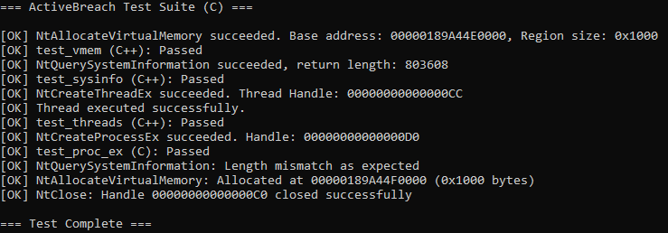
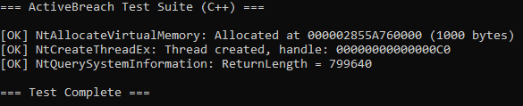
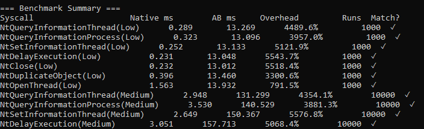

## ActiveBreach Engine

SysWhispers & Hell’s Gate Successor — Dynamic Syscall Dispatch Engine with Runtime Debugger & Anti-Tamper, Bypasses Userland Hooks & Kernel Callbacks

Originally inspired by a blogpost by [MDSEC](https://www.mdsec.co.uk/2020/12/bypassing-user-mode-hooks-and-direct-invocation-of-system-calls-for-red-teams/), and concepts from **SysWhispers**, and **Hell’s Gate**. This framework expands on the core ideas and introduces a fully fledged engine for red teams to use.

---

### Why ActiveBreach?

Common syscall frameworks like **SysWhispers** and **Hell's Gate** provide static wrappers or inject precompiled stubs to facilitate direct system call execution. While effective for bypassing usermode API hooks, these approaches generally do not account for the broader execution environment or the side-effects of executing syscalls from within observable thread contexts.

Several limitations are common across these tools:

* Syscalls execute on the original thread and stack, exposing RIP and RSP to external inspection
* No runtime validation or awareness of debugging, instrumentation, or execution anomalies
* Stub code is static or pattern-derived, making it vulnerable to signature-based detection
* Syscall instructions are embedded in the binary and remain visible in memory
* Memory allocated for stubs is often RWX or left unprotected post-use
* No separation between caller and syscall execution context
* No support for tracing, argument validation, or NTSTATUS classification during execution

**ActiveBreach** was developed to address these constraints by modeling syscall execution as a controllable and inspectable runtime event rather than a direct instruction dispatch.

It uses:

* On disk encrypted stub templates, decrypted at runtime
* Memory stub Encryption/Decryption (Rust)
* Isolated execution via threadpool workers to separate call context
* Anti-tamper validation of the current thread’s stack, RIP chain, and TEB
* Optional runtime introspection for debugging, violation logging, and symbolic trace inspection

This approach favors a more resilient and robust stealth-conscious syscall model — particularly in environments where thread visibility, memory layout, and call traceability are monitored or constrained.

---

### How ActiveBreach Works

ActiveBreach bypasses the standard `ntdll.dll` syscall interface, which is frequently instrumented by EDRs, antivirus, and anti-cheat systems. Instead, it implements a standalone syscall dispatch layer that replicates the behavior of `Nt*` functions without invoking any standard usermode API paths.

All syscalls are executed via a threadpool-backed dispatch mechanism. Each call is proxied through an isolated worker thread, decoupling the execution context from the original caller. This provides a clean stack, unlinked RIP, and a controlled memory region for stub execution.

This model enables additional layers such as:

* **Anti-Tamper instrumentation**, which validates thread state, PEB/TEB integrity, and call origin
* **Debugging & symbolic tracing**, optionally enabled via `AB_DEBUG`, allowing runtime inspection of syscall arguments, return values, and violation counters

The result is a self-contained, context-aware syscall runtime that minimizes exposure while retaining visibility and control during execution.

---

### Test Coverage

For C & C++, they can be found in the solution.

For Rust, it can be found in ``/tests/``





---

### ActiveBreach Language Implementations

### C Edition

The C implementation is the smallest and most direct variant, designed for simplicity, portability, and minimal footprint.

* Exposes a clean API (`ab_call_func`) for direct `Nt*` syscall invocation
* Parses and reconstructs `ntdll.dll` from disk to extract SSNs without touching loaded modules
* Dynamically builds syscall stubs in RWX memory, 16-byte aligned
* Operates with a dedicated dispatcher thread and call queue (no TLS callbacks or threadpool reuse)
* Minimal runtime context tracking — no anti-tamper or debugger integration
* No encryption of memory, symbols, or stub instructions
* Fastest build and lowest binary overhead, but least stealthy

## C++ Edition

The C++ variant offers more extensive runtime inspection and anti-tampering capabilities.

* Implements **AntiBreach**, a low-level runtime verification layer that monitors `.text` integrity, stack traces, and debugger presence.
* Ships with **ActiveBreachDebugger**, a syscall introspection tool that maps arguments, tracks state, and validates syscall behavior during runtime.
* Leverages C++ RAII, compile-time features (C++14/20), and idiomatic MSVC extensions.
* Decrypts stub templates on runtime, stays encryped on disk.
* Provides real-time violation detection via TEB checks, RIP chain analysis, and timing-based callbacks (e.g. `__rdtsc()` delta inspection).
* ThreadPool-based syscall dispatch.

## Rust Edition

The most advanced implementation. No debugging or Anti-Tamper but significantly more stealthy.

* Structured as a crate; can be embedded directly or compiled as a standalone DLL (DLL not currently implemented, easily done though)
* Implements isolated dispatcher thread backed by encrypted ring buffer of syscall stubs
* Uses unsignatured LEA-based symmetric encryption to obfuscate stub memory at rest
* Dynamically parses and extracts SSNs from a clean memory-mapped `ntdll.dll`, avoiding any loaded image interaction
* All syscall requests are queued through a global atomic operation frame, routed through a dispatcher, and executed in a tightly controlled thread context
* No OS-level synchronization primitives are used; the runtime is driven entirely by atomic operations and yielding, minimizing observable artifacts
* Internal stub memory is 16-byte aligned, RWX at runtime only during execution window, and otherwise page-protected with `PAGE_NOACCESS`

### Example: Hooked API Flow vs ActiveBreach

```
User Process
    │
    ├──▶ CreateFile (Wrapper, kernel32.dll)
    │         │
    │         ▼
    │    NtCreateFile (ntdll.dll)   <─── [Hooked by AntiVirus/AntiCheat]
    │         │ 
    │         ▼
    │   [Hook Handler]  <─── (Monitoring, logging, blocking, etc...)
    │         │
    │         ▼
    │  Kernel (Syscall)  <─── (Actual system call after handling)
    │ 
    ▼ 
  Return 
```

---

### **ActiveBreach API call**
```
User Process
    │
    ├──▶ ab_call("NtCreateFile")  <─── (Not using "CreateFile" as ActiveBreach only supports Nt functions)
    │         │
    │         │
    │         │
    │         │
    │         │
    │         ▼
    │  Kernel (Syscall)  <─── (Direct system call without passing through `ntdll.dll`)
    │ 
    ▼ 
  Return
```

---

## Usage
See [USAGE.md](USAGE.md) for full setup & examples in **C, C++ & Rust**.

---

## License

**Creative Commons Attribution-NonCommercial 4.0 International (CC BY-NC 4.0)**  

[Full License](https://creativecommons.org/licenses/by-nc/4.0/)

---

## Disclaimer
This tool is for educational and research use only. Use at your own risk. You are solely responsible for how you use this code.
